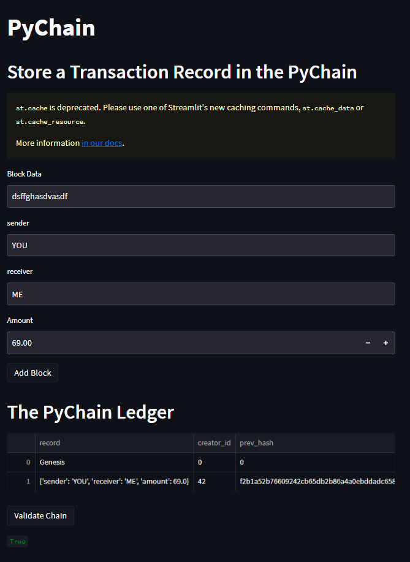
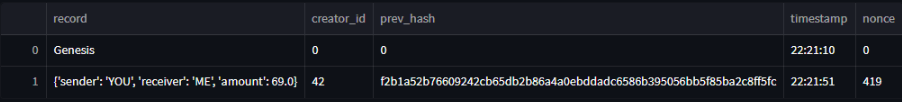

# Module 18 Challenge
## Streamlit Demo

## Ledger exanded view

This streamlit application works by creating the dataclass 'Record,' and instantiating variables for the sender, receiver and amount so transactions can be added to the block. The two following created classes use the self.record attribute to retrieve data for encoding and hashing. Four text input boxes are created for user input, allowing for block data, sender, receiver and amount information to be gathered and used by the application.